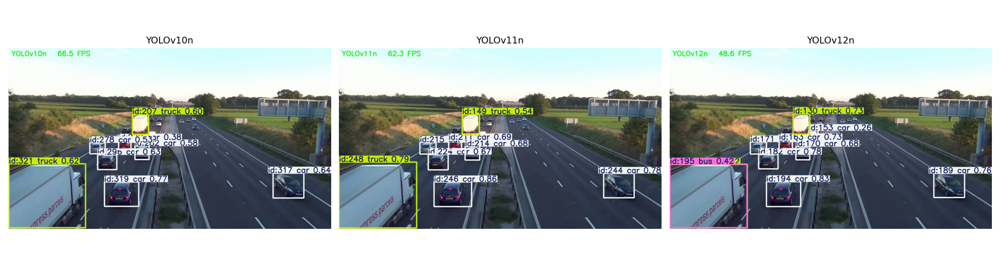
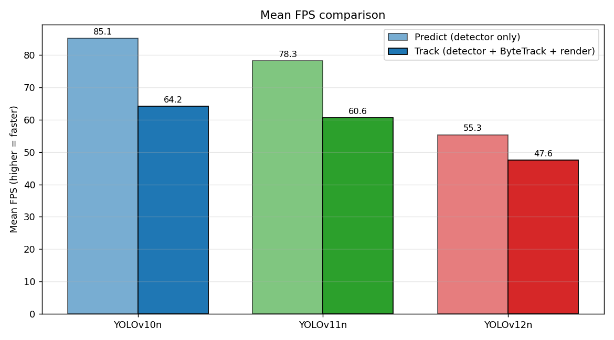

# YOLO Nano Tracking Benchmarks


An empirical analysis comparing the inference speed and tracking efficiency of three nano-scale object detection models: **YOLOv10n, YOLOv11n, and YOLOv12n**. ByteTrack is utilized as the standard association algorithm across all tests to isolate the pure detection cost.



## Overview

Real-time object tracking is a critical component of intelligent transportation systems and surveillance. With the rapid evolution of YOLO architectures, this repository benchmarks the recent nano-scale models to evaluate the trade-off between architectural complexity and computational latency. 

The experiment tracks vehicles in a 30 FPS high-definition (720p) video sequence using a strict, controlled Kaggle environment.

## Key Findings

While newer architectures like YOLOv12n offer advanced feature extraction capabilities, they exhibit a measurable increase in inference latency compared to the YOLOv10n baseline. Mean metrics can obscure system jitter, making the tight variance (p95 latency) of YOLOv10n highly desirable for strict real-time pipelines.

| Model | Params | Predict FPS | Track FPS | Predict Mean | Track Mean | Track p95 |
|---|---:|---:|---:|---:|---:|---:|
| **YOLOv10n** | 2,775,520 | 85.1 | 64.2 | 11.78 ms | 16.16 ms | 17.17 ms |
| **YOLOv11n** | 2,624,080 | 78.3 | 60.6 | 12.81 ms | 16.55 ms | 17.99 ms |
| **YOLOv12n** | 2,603,056 | 55.3 | 47.6 | 18.10 ms | 21.09 ms | 22.87 ms |



## Repository Structure

```
yolo-nano-tracking-benchmarks/
├── notebooks/
│   └── yolo_tracking_comparison.ipynb   # Main experimental pipeline
├── docs/
│   ├── report.tex                       # Academic LaTeX research report
│   └── report.pdf                       # Compiled PDF report
├── results/
│   ├── plots/                           # Generated visualizations
│   ├── sample_frames/                   # Extracted video frames
│   └── logs/                            # Raw CSV/JSON latency logs
├── weights/                             # Pre-trained YOLO weights (Gitignored)
├── outputs/                             # Tracked MP4 videos (Gitignored)
└── README.md
```

## Reproducibility

1. Clone the repository and install dependencies:
   ```bash
   pip install ultralytics>=8.3.0 lap>=0.5.12 pandas matplotlib
   ```
2. Download the pre-trained weights for YOLOv10n, v11n, and v12n into the `weights/` directory.
3. Place your target video in the `outputs/` directory and update the `INPUT_VIDEO` path in the Jupyter Notebook.
4. Execute `notebooks/yolo_tracking_comparison.ipynb` cell by cell.

## Research Report

For a deep dive into the methodology, pipeline stage breakdowns (Preprocess vs. Inference vs. Postprocess), and statistical variance analysis, please read the [LaTeX Research Report](docs/report.pdf).

## License

This project is licensed under the MIT License - see the [LICENSE](LICENSE) file for details.
